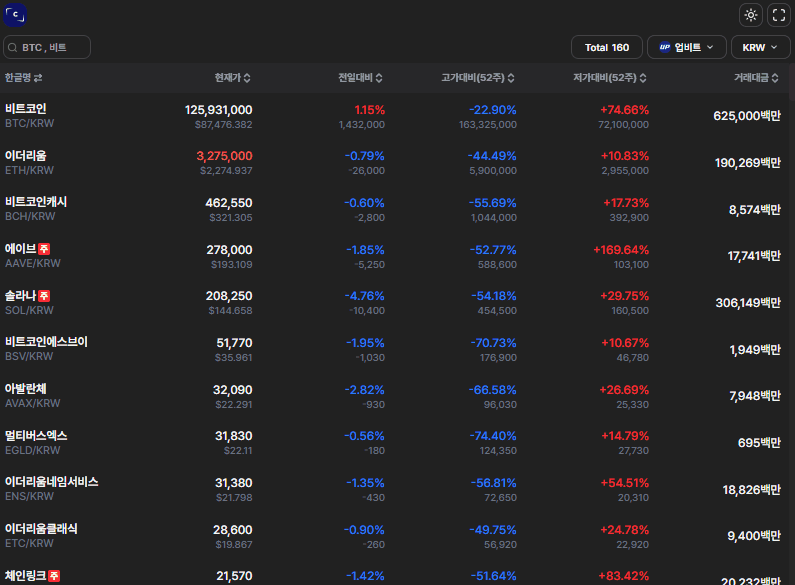

<div align="center" >
<br>
<h1>COMO</h1>
<h3>(암호화폐 시세조회 익스텐션)</h3>
<br>
</div>

### 프로젝트 소개

암호화폐 시세를 빠르고 간편하게 조회할 수 있는 브라우저 확장프로그램입니다. 주요 암호화폐 거래소들의 종목 가격을 제공합니다.



### 기술

<div>


  


</div>

### 디렉토리

```
como
   ├ packages                        # 애플리케이션에서 공유하는 모듈(타입,UI,Config)
   └ *apps                           # Turborepo의 애플리케이션 단위 프로젝트 폴더
       └ *chrome-extension           # Chrome 브라우저용 확장 프로그램
           ├ dist                    # Vite로 빌드된 최종 번들 파일이 저장되는 폴더
           ├ public                  # 메타데이터와 권한을 정의하는 manifest.json이 위치
           ├ *src                    # 확장 프로그램의 핵심 소스 코드
              └ *background          # Chrome 확장의 background script 및 Fetching,WebSocket 로직
           └ *pages                  # 확장 프로그램의 UI 페이지 구성
              └ *popup               # 확장 프로그램의 팝업 페이지
                 └ *src              # 팝업 페이지 관련 소스 코드
                    ├ *components    # 재사용 가능한 컴포넌트
                    ├ *types         # TypeScript 인터페이스 및 타입 정의
                    ├ *styles        # Tailwind CSS 스타일 파일
```

**Chrome webstore 링크** [COMO Webstore](https://chromewebstore.google.com/detail/comoturbo/camiahnljjgndaficdcpboimdbdphnok?hl=ko)
